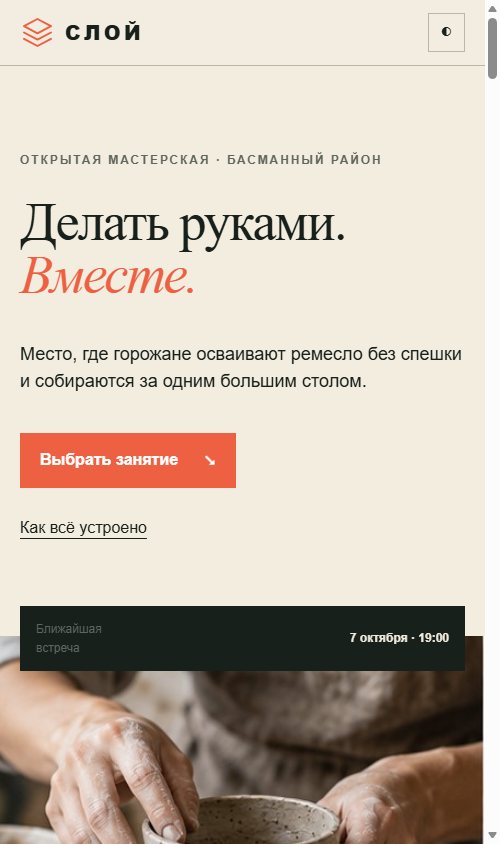
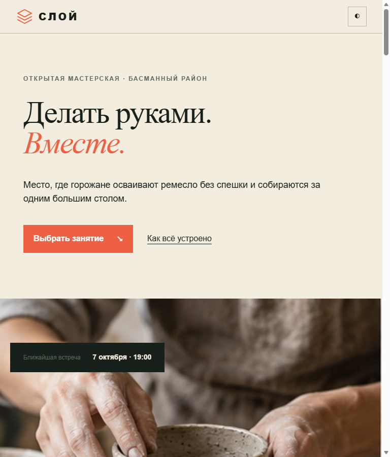
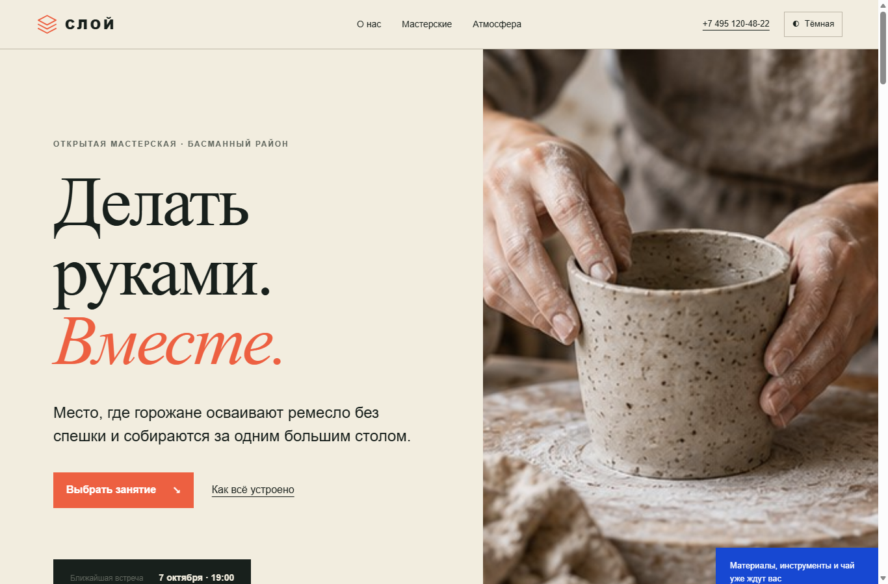

# СЛОЙ — открытые городские мастерские

Одностраничный сайт вымышленной городской инициативы. Проект выполнен на чистых HTML, CSS и JavaScript: без сборщика, фреймворков и внешних JS-зависимостей.

Опубликованная версия: <https://rorikit.github.io/sloy-workshops/>

## Скриншоты

### Узкий экран — 360 px

### Средний экран — 768 px

### Широкий экран — 1200 px

## Просмотр

Для локального просмотра скачайте репозиторий и откройте `index.html` в браузере. Установка зависимостей, сборка и локальный сервер не требуются.

## Что реализовано

- семантическая структура и навигация по существующим разделам;
- восемь карточек с датой, временем, длительностью, изображением и действием;
- текстовый поиск и четыре независимых состояния категорий;
- сохранение избранного и выбранной темы в `localStorage`;
- автоматическая тема по системной настройке и ручное переключение;
- доступное модальное окно записи на базе `dialog`, закрытие по Escape/кнопке/фону и возврат фокуса;
- адаптивные сетки для узкого, среднего и широкого экрана;
- состояния hover, focus, active, empty state и поддержка `prefers-reduced-motion`;

## Собственные решения и проверка

Самыми трудными частями стали адаптивная композиция первого экрана, карточки с описаниями разной длины и сохранение читаемости в обеих цветовых темах. Для первого экрана использованы разные схемы компоновки: две колонки на широком экране и последовательный поток «текст → ближайшая встреча → изображение» на планшете и телефоне. Благодаря этому элементы не зависят от фиксированных координат и не перекрывают друг друга.

Адаптивность проверялась экспериментально в браузере на viewport 360×800, 768×900 и 1366×900 px. На каждом размере страница открывалась отдельно, проверялись переносы заголовков, расположение плашек, карточек и изображения, работа светлой и тёмной тем, а также отсутствие горизонтальной прокрутки. Дополнительно сравнивались `innerWidth`, ширина корневого элемента и ширина `body`: на узком экране все значения составили 360 px, а на среднем — 768 px.

После проверки мобильный и планшетный варианты первого экрана были переведены в последовательный поток, убраны абсолютное позиционирование плашки и лишняя минимальная высота, скорректированы размеры заголовка и отступы. Также ссылка перехода к содержанию была скрыта до получения фокуса. После повторного эксперимента наложения и горизонтальное переполнение больше не воспроизводились.

## Источники

- Восемь растровых изображений созданы специально для проекта встроенным OpenAI ImageGen и хранятся локально в `assets/`. Итоговый промпт описан в `REPORT.md`.
- Шрифты [Manrope и Prata](https://fonts.google.com/) — Google Fonts, лицензия SIL Open Font License.
- Видео с керамистом в мастерской: [Mixkit — Ceramic artist working in the workshop](https://mixkit.co/free-stock-video/ceramic-artist-working-in-the-workshop-1971/), Mixkit Stock Video Free License. Файл сохранён локально как `assets/atmosphere.mp4` для надёжного воспроизведения.
- Логотип, favicon и декоративная SVG-линия созданы для проекта вручную.

## Состав проекта

- `index.html` — структура и тексты;
- `styles.css` — темы, сетки, состояния и адаптивность;
- `script.js` — фильтры, избранное, тема и модальное окно;
- `assets/` — изображения и favicon;
- `REPORT.md` — подробный отчёт и материалы для защиты;
- `screenshot-mobile.png`, `screenshot-medium.png`, `screenshot-wide.png` — контрольные снимки;
- `crop-assets.ps1` — воспроизводимая нарезка исходного авторского фотолиста на восемь кадров.

## Ограничение демонстрационной версии

Форма имитирует успешную отправку и не передаёт данные на сервер. Подключение CRM/API не входит в учебную задачу.
